# LoRA Manager (SD Model Viewer)

一个优雅、高（？）性能的本地Stable Diffusion 模型(主要是LoRA模型)管理、图库管理和提示词辅助工具。（主要围绕Civitai元数据与本地SD生态设计，联网同步Civitai时国内需要魔法）

专为解决本地模型混乱、预览图缺失、元数据难以查看、本地返图管理难而设计。无需启动WebUI，即可快速浏览、筛选和管理你的LoRA库及生成的图片，也可以直接调用本地大模型辅助改写提示词。

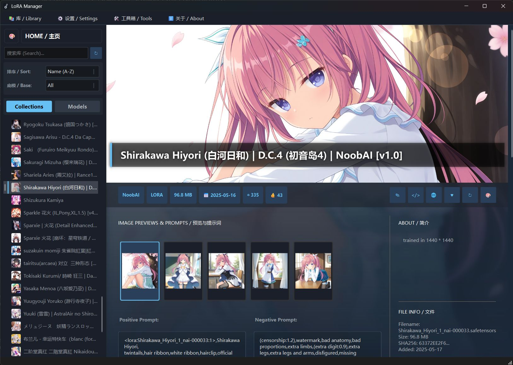

## ✨ 主要特性 (Features)

### 🎨 沉浸式 UI 设计
*   **Hero 风格详情页**：采用类Steam游戏库的沉浸式设计，顶部大图展示。
*   **动态背景模糊**：根据当前模型封面自动生成高斯模糊背景，并支持平滑的交叉淡入淡出 (Cross-fade) 动画，切换模型丝滑流畅。
*   **安全模式 (NSFW Filter)**：内置内容过滤系统，支持“高斯模糊”或“完全隐藏”两种模式，可自定义过滤等级阈值，在公共场合也能放心浏览。
*   **自适应布局**：支持窗口任意缩放，背景与前景图完美对齐。

### 🖼️ 本地图库与 Prompt 解析 (New!)
*   **本地返图扫描**：自动扫描 Stable Diffusion 的输出目录（`outputs`），并根据当前选中的 LoRA **智能筛选**出使用了该 LoRA 的本地图片。
*   **多图库路径支持**：支持添加多个图库目录，并可通过路径管理窗口临时启用/禁用某个目录，不需要反复删除和重新添加。
*   **更可靠的 LoRA 匹配**：支持按原有名称逻辑、摘要值逻辑以及严格摘要值逻辑匹配本地返图，减少普通 tag 与 LoRA 名称重名导致的误匹配。
*   **PNG Info 解析**：无需拖入 WebUI，点击图片即可查看完整的生成信息（Positive Prompt, Negative Prompt, Seed, Sampler 等）。
*   **Tag 瀑布流**：自动从 Prompt 中提取 Tag 并按频率统计，形成直观的瀑布流标签页。
*   **Tag 搜索与排序**：本地返图 Tag 支持按使用次数/字母序排序，支持英文或中文翻译搜索，也可以只显示 LoRA Tag。
*   **Tag 翻译系统**：
    *   **中英对照**：支持加载自定义 CSV 词表，一键切换中英对照显示。
    *   **批量导出**：右键菜单支持批量导出 Tags，可复制到剪贴板或导出 CSV，并支持全部导出、Top K、使用次数阈值等范围。
*   **WD14 反推 Tag**：提示词解析工具内置 WD14 反推页面，可调用已有 SD/Python 环境进行图片反推，支持阈值、附加/排除标签、置信度显示、翻译显示和结果复制。

### 🚀 高性能与本地化
*   **C++ & Qt 构建**：相比 Electron 或 Python 界面，拥有更低的内存占用和更快的启动速度。
*   **多线程扫描**：内置线程池技术，支持扫描进度实时提示，秒级（划掉）加载数千个本地模型文件。（假的）
*   **懒加载机制**：画廊视图、Tag 浏览、缩略图和工具页采用异步/懒加载，尽量减少界面卡顿。
*   **递归扫描**：支持自定义是否递归扫描子文件夹（LoRA 目录和图库目录均支持）。
*   **缓存统一管理**：路径、Tag 翻译表、图库缓存等配置统一保存在 `config/settings.json` 和 `config` 目录下，便于迁移和备份。

### ☁️ 智能元数据获取
*   **自动匹配 Civitai**：通过计算本地文件 SHA256 哈希值，自动从 Civitai API 拉取模型封面、简介、版本信息及触发词。
*   **触发词一键复制**：详情页直接展示 Trigger Words，点击即可复制，提高生图效率。
*   **本地/已编辑模型支持**：支持手动编辑模型详情、触发词、简介、预览图和图片元信息；编辑后会标记为本地/已编辑模型，避免同步时不小心覆盖。
*   **灵活同步策略**：刷新元数据时可选择同步全部、仅同步 metadata JSON 或取消同步；检测到本地/已编辑模型时会提醒，也可在设置中关闭该提醒。
*   **预览图管理**：支持上传、替换、删除、重新下载预览图，并可打开预览图所在位置。

### 📂 强大的管理功能
*   **自定义收藏夹**：支持创建多个收藏夹（如“二次元”、“写实”、“机甲”），右键模型或卡片即可快速归类/移除。
*   **多路径模型库**：支持多个 LoRA 模型目录，每个目录可单独启用/禁用，适合把不同 WebUI、不同硬盘或不同风格的模型分开管理。
*   **文件夹分组与折叠**：Models 列表可按 LoRA 根目录分组，并支持折叠/展开；收藏夹也可按“收藏夹/文件夹/模型”或“文件夹/收藏夹/模型”组织。
*   **模型高亮颜色**：可为模型设置带透明度的高亮颜色，在 Models 列表和 Collections 树中快速定位常用或重点模型。
*   **多维度筛选**：支持按底模 (SD 1.5, SDXL, Pony 等)、下载量、点赞数、创建日期、下载时间、名称、本地返图使用次数和最近使用时间排序。
*   **全局搜索**：支持按模型名称或底模类型进行实时过滤搜索。
*   **本地缓存**：元数据和图片自动缓存到本地 JSON，离线状态下也能完整浏览。

### 🤖 大模型提示词助手
*   **Ollama / LM Studio 支持**：可选择本地 Ollama 或 OpenAI 兼容的 LM Studio API，调用本地大模型辅助提示词生成。
*   **提示词改写任务**：支持人物替换、服装替换、图片调整和用户偏好提示词生成等任务类型。
*   **LoRA 与图片上下文**：可从本地 LoRA 库和图库中选择候选上下文，支持自动读取触发词、预览图提示词，也支持手动输入补充信息。
*   **可编辑提示词模板**：系统提示词、任务模板、`task_guidance`、图片附加说明等都可以在界面中调整并重置，适合折腾自己的工作流。
*   **ChatGPT 风格对话页**：生成提示词会自动创建对话，可继续修改、上传参考图、查看思考内容、停止生成、复制、编辑、删除和重新生成消息。
*   **历史保存**：对话历史保存在 `config/llm_conversations.json`，图片只保存路径，文件移动后会显示占位符而不是崩溃。

### 🧰 工具箱
*   **同步工具**：保留独立同步页，方便批量处理 Civitai 元数据。
*   **提示词解析**：支持 PNG 参数解析、正负 Tag 拆分、翻译显示以及 WD14 反推。
*   **Tag 浏览器**：支持编辑 CSV 翻译表，也可以查看用户历史图库中实际使用过的正面/负面 Tag，支持搜索匹配方式、排序、多选、复制和 CSV 导出。
*   **大模型工具**：集成提示词生成、对话历史和大模型设置，不需要在多个软件之间来回复制粘贴。

## 📸 界面预览 (Screenshots)

### 主页画廊 (Home Gallery)
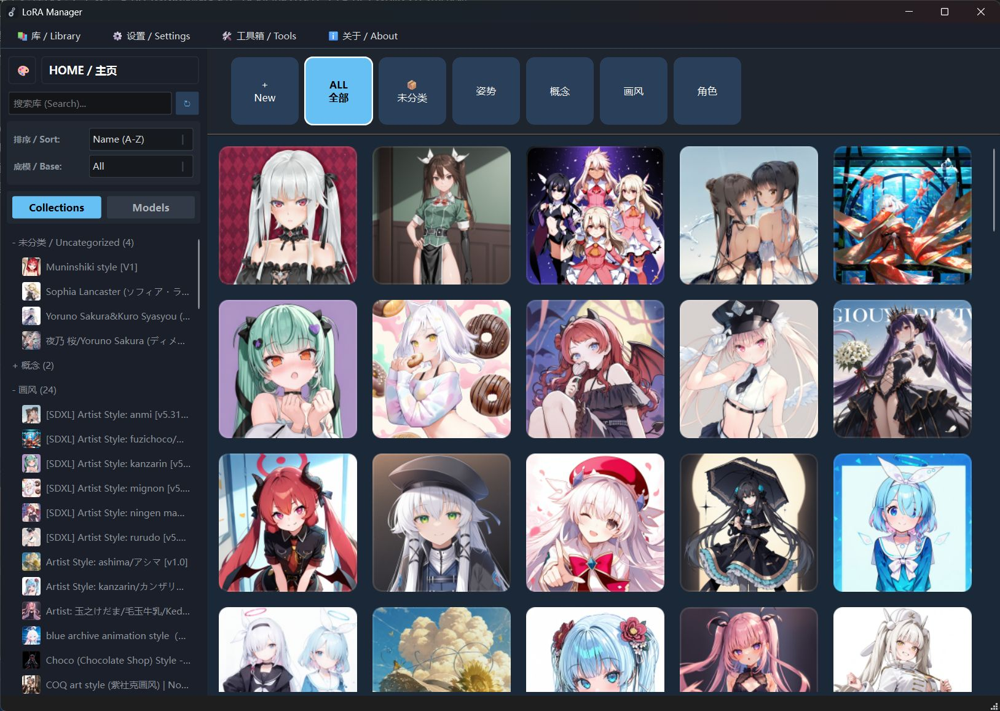

### 模型详情页 (Detail View)
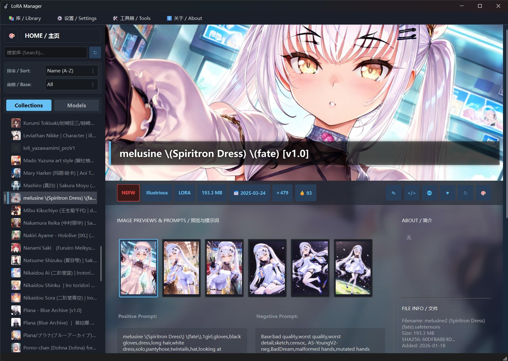

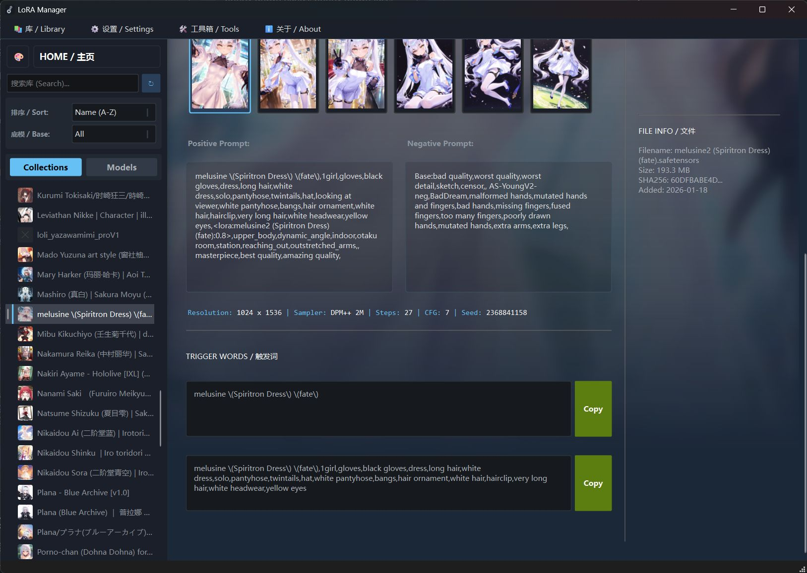

### 图库页与 Tag 解析 (Gallery & Tag Analysis)
*(包含本地返图浏览、Prompt 解析及中英文 Tag 对照)*

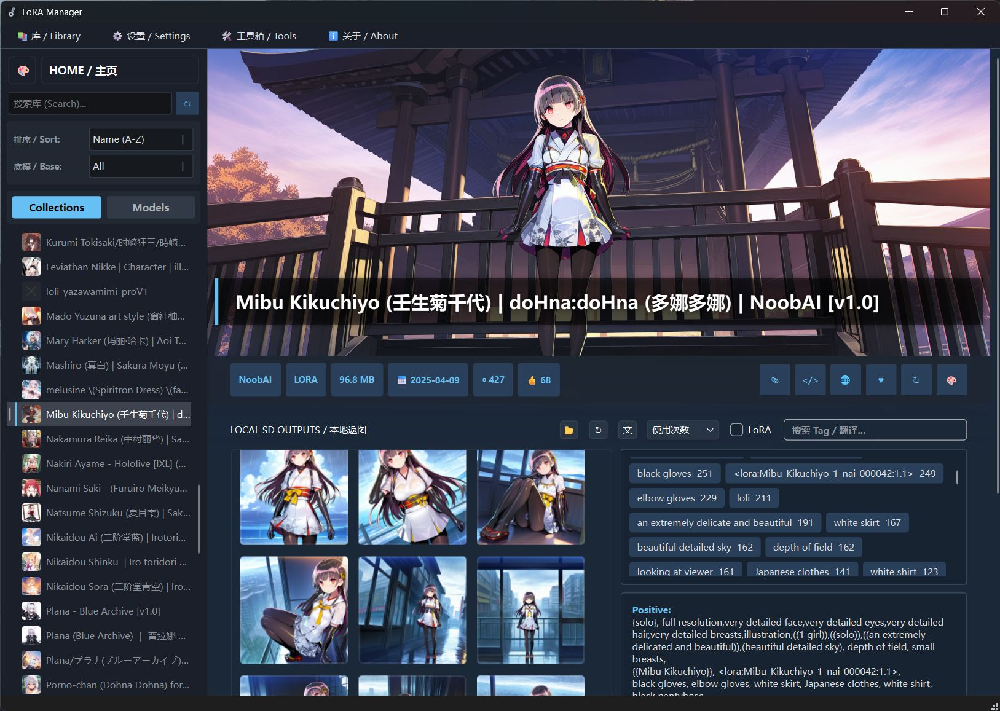

### 工具箱 (Tools)
*(包含图片同步、Tag 浏览、WD14 反推、大模型提示词生成与对话管理等功能)*
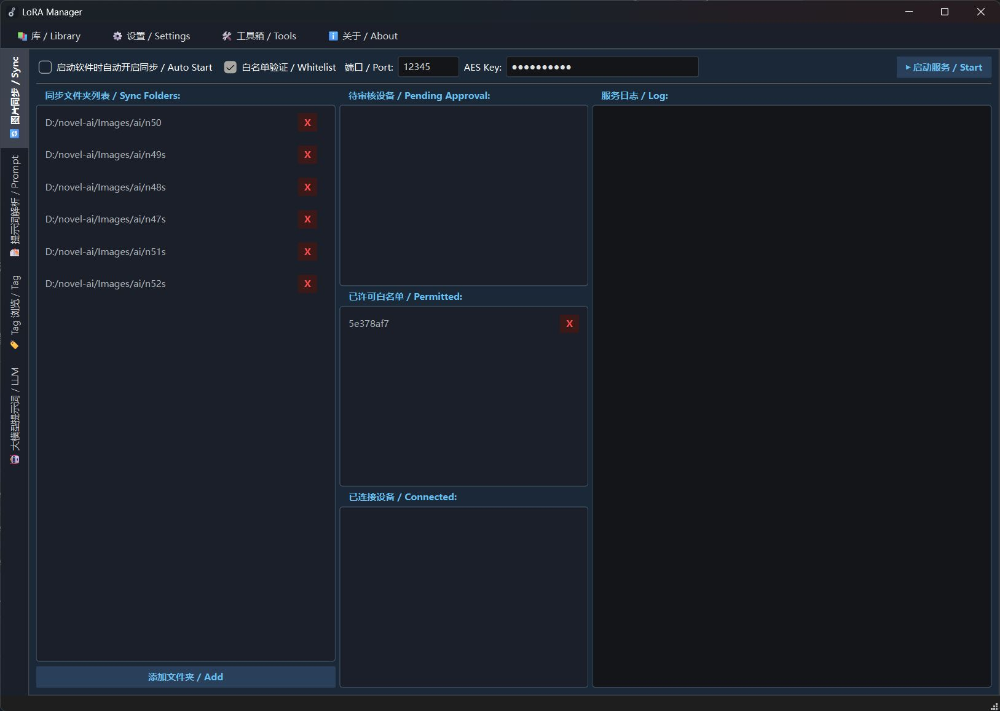
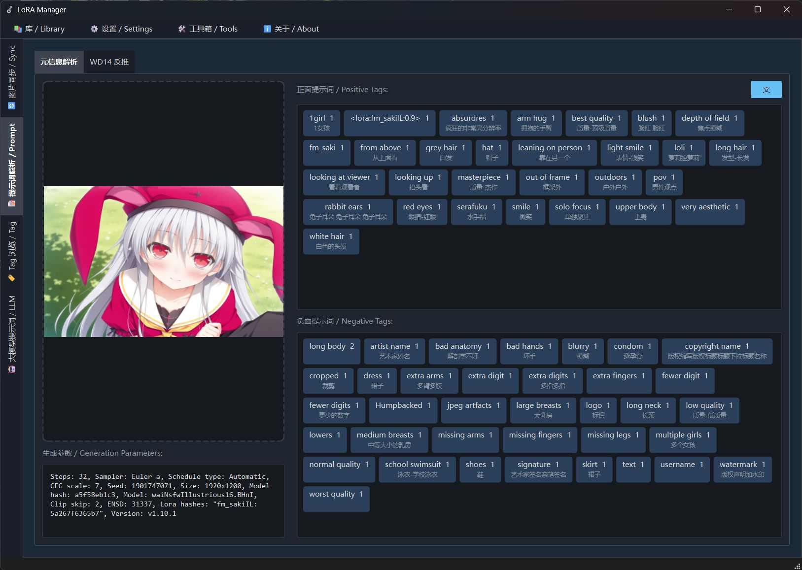
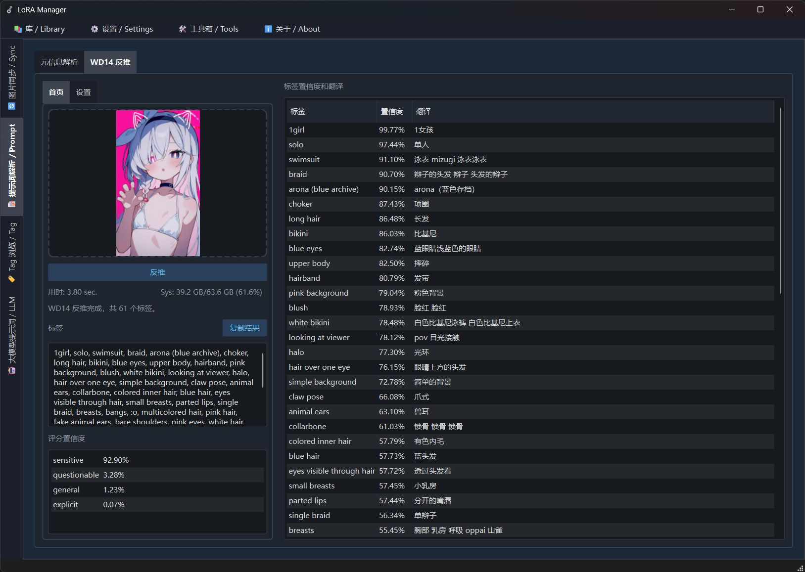
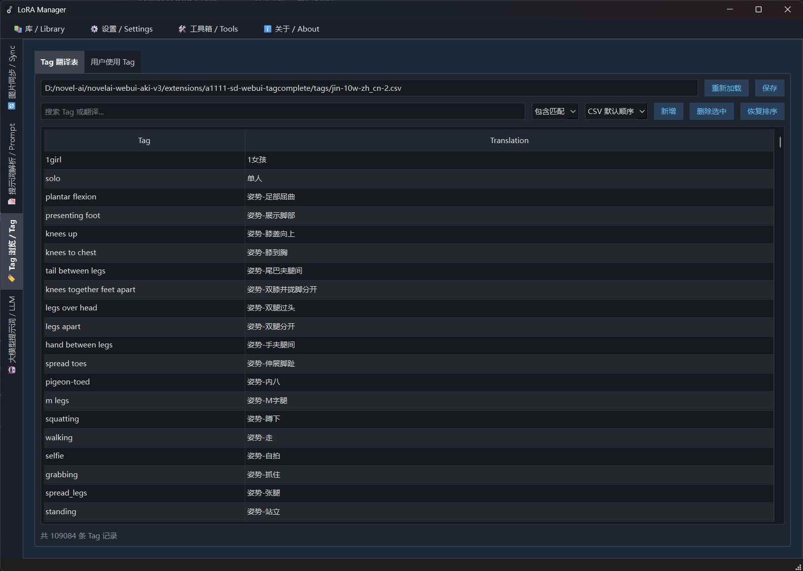
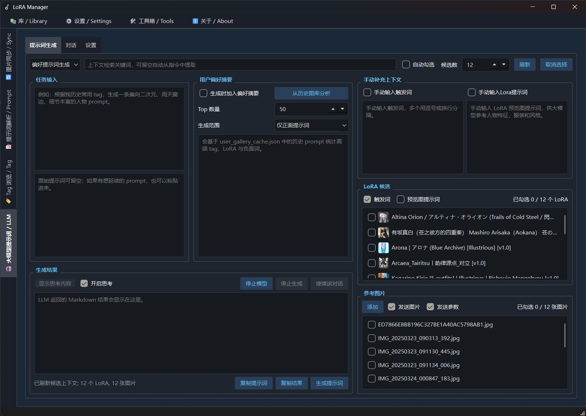
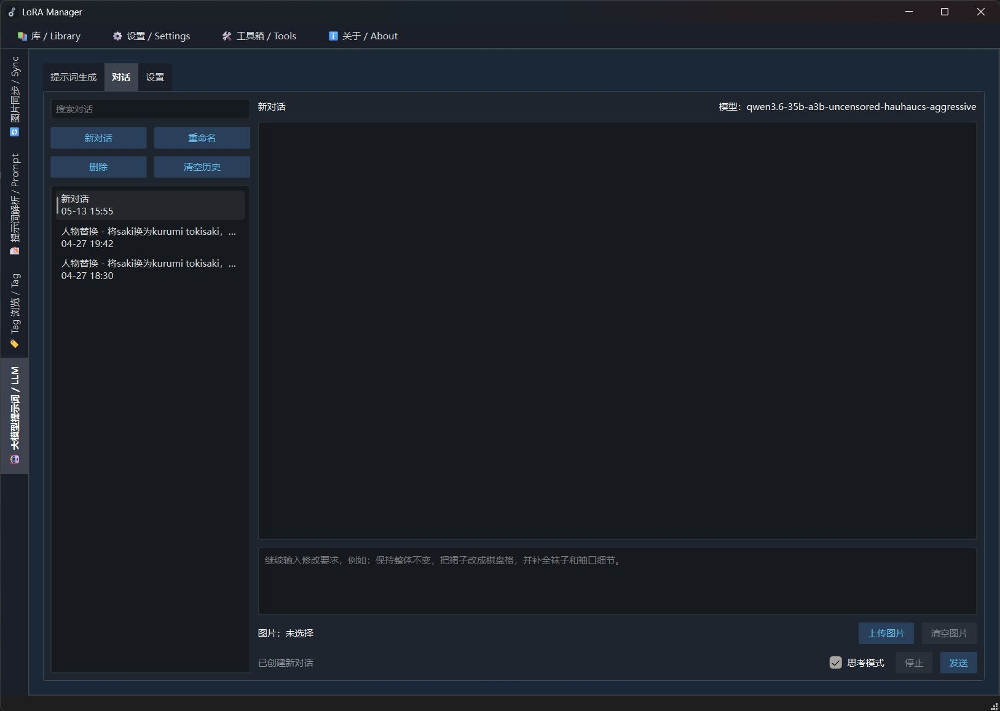

### 设置页 (Settings)
*(支持 NSFW 等级设置、多路径配置、翻译词表加载、图库匹配逻辑、文件夹分组等设置)*

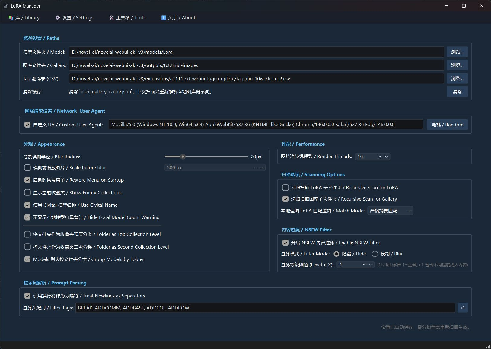

## 🛠️ 安装与运行 (Installation)

### 直接运行 (Windows)

1.  前往 Release 页面下载最新的可执行文件（.exe）。
2.  双击 `SD_LoRA_Manager.exe` 即可运行。
3.  首次运行请在设置页指定你的 **LoRA 模型文件夹** 和 **Stable Diffusion 输出目录**。现在支持添加多个路径，并可通过复选框临时启用/禁用。
4.  (可选) 在设置页加载 `tags` 目录下的 CSV 文件以开启 Tag 翻译功能。
5.  (可选) 如果要使用大模型功能，请先启动 Ollama 或 LM Studio，并在工具箱的大模型设置中配置模型与 API 地址。
6.  (可选) 如果要使用 WD14 反推，请配置可用的 Python/SD 环境命令，确保该环境能运行对应的 tagger 脚本。

> **注意**：如果提示缺少 DLL，请安装 [VC_Redist.x64](https://learn.microsoft.com/cpp/windows/latest-supported-vc-redist)。如果无法联网获取元数据，请确保系统已安装 OpenSSL 库。

### 从源码构建 (Build from Source)

如果你是开发者，想自己编译或修改代码：

**前置要求：**

*   Qt 6.2 或更高版本 (推荐使用 MSVC 2019/2022 编译器)（近期开发环境主要使用 6.11.x）
*   CMake
*   OpenSSL 开发库 (用于 HTTPS 请求)
*   **请一定要安装 Image Formats 插件**！！！！（不然你会为为什么加载不出来 WebP/HEIC 等图片困扰几个小时，笑）

**步骤：**

1.  克隆仓库：
    ```bash
    git clone https://github.com/hanbinhsh/SD-LoRA-Manager.git
    ```
2.  使用 Qt Creator 打开 `CMakeLists.txt` 文件。
3.  配置项目（推荐选择 Release 模式以获得最佳性能）。
4.  构建并运行。

## ⚙️ 常见问题 (FAQ)

**Q: 为什么有些模型无法获取封面？**

A: 软件通过计算文件 Hash 去 Civitai 匹配。如果该模型已从 C 站下架，或者你是从其他渠道下载的（Hash 不一致），则无法自动获取。你可以手动将预览图命名为 `模型名.preview.png` 放在同级目录下。

另外请尝试在设置中开启自定义UA（User Agent）选项，并查询你浏览器的UA填入

**Q: 本地返图扫描不到图片？**

A: 请确保：1. 在设置页正确设置了 SD 的 `outputs` 目录；2. 你的图片是 PNG 格式且保留了 Metadata 信息（ComfyUI 和 WebUI 生成的均支持）；3. 确保勾选了“递归扫描”如果你的图片在子文件夹中。

如果你发现扫描到了不是这个 LoRA 生成的图片，可以在设置中调整“本地返图 LoRA 匹配逻辑”，例如改为按摘要值匹配或严格摘要值匹配。

**Q: Tag 翻译不显示？**

A: 请前往设置页加载 CSV 翻译表（通常位于 `\extensions\a1111-sd-webui-tagcomplete\tags`），然后在图库页点击“文”字按钮开启翻译模式。

**Q: 大模型功能怎么用？**

A: 先启动 Ollama 或 LM Studio，再到工具箱的大模型设置页选择后端、填写 API 地址和模型名。Ollama 默认地址通常是 `http://127.0.0.1:11434`，LM Studio 默认地址通常是 `http://127.0.0.1:1234`。

**Q: 勾选“生成时加入偏好”有什么用？**

A: 软件会从本地图库缓存里统计你常用的正面 Tag、负面 Tag 和 LoRA，并把摘要加入发给大模型的上下文，让模型更倾向于生成符合你历史习惯的提示词。

**Q: 启动速度有点慢？**

A: 首次扫描大量模型（>1000个）时需要读取本地文件、元数据和缩略图，这取决于磁盘 IO 速度。后续启动会读取本地缓存，速度会非常快（存疑？）。如果 Tag 词表非常大，Tag 浏览器会在进入页面后再懒加载，避免拖慢启动。

**Q: 为什么有这么多BUG？**

A: 你说得对但是软件由本人一人在一天之内完成所有代码（感谢我的AI朋友们）。

## 🤝 贡献 (Contributing)

欢迎提交 Issue 和 Pull Request！
如果你有好的 UI 想法或者功能建议，请随时告诉我。

---

**Developed with ❤️ by IceRinne**
